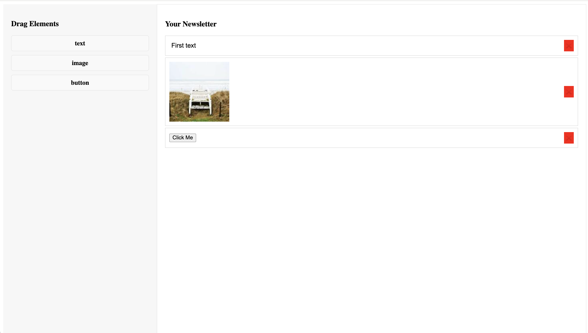

# Drag-and-Drop Newsletter Builder

A **React-based** drag-and-drop web app that allows users to design newsletters effortlessly. Built with **React DnD**, this tool enables users to add **text, images, and buttons** to a newsletter canvas, reorder elements, and delete unwanted components.



## 📺 Demo


---

## Features

- **Drag and drop** text, images, and buttons into the newsletter.
- **Reorder elements** within the canvas using drag-and-drop.
- **Remove elements** with a delete button.
- **Editable text fields** for customized content.
- **Random image generator** for placeholders.

---

## Tech Stack

- **Frontend:** React, React DnD
- **State Management:** useState
- **Styling:** CSS

---

## 🛠️ Installation & Setup

1️⃣ Clone the repository:

```bash
  git clone https://github.com/Soumya98-dev/Responsive-NewsLetter-Builder.git
  cd newsletter-builder
```

2️⃣ Install dependencies:

```bash
  npm install
```

3️⃣ Start the development server:

```bash
  npm run dev
```

4️⃣ Open in the browser:

```
  http://localhost:3000
```

---

## 📖 Usage

- Drag elements (Text, Image, Button) from the **sidebar** to the **canvas**.
- Click on **text fields** to edit their content.
- Reorder elements within the canvas by dragging.
- Click the **red ❌ button** to remove an element.

---

## 💡 Future Enhancements

- **Export as HTML/PDF** for real-world email campaigns.
- **Save & Load newsletters** using Firebase or Local Storage.
- **Customize styles** (text fonts, image resizing, button colors).
- **Add email-sending functionality** using SendGrid or Nodemailer.
- **Collaborative Editing** (multiple users working on the same newsletter).

---

## 🎯 Use Cases

- **Marketing Teams** – Create promotional email templates.
- **Corporate Teams** – Design company newsletters effortlessly.
- **Educators & Bloggers** – Create and share educational updates.
- **Resume Builder** – Convert into a customizable CV maker.

---

## 🤝 Contributing

1️⃣ Fork the repository.
2️⃣ Create a feature branch (`git checkout -b feature-name`).
3️⃣ Commit changes (`git commit -m 'Add new feature'`).
4️⃣ Push the branch (`git push origin feature-name`).
5️⃣ Open a **Pull Request**.

---

## Show Your Support

If you like this project, **give it a star on GitHub!**
